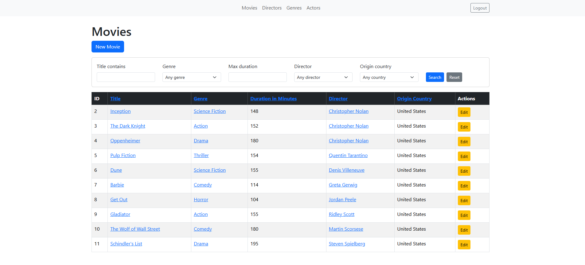
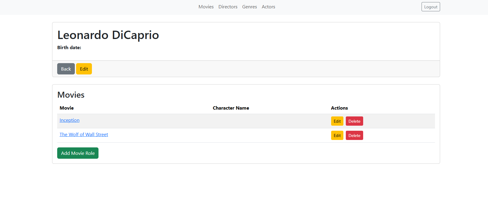
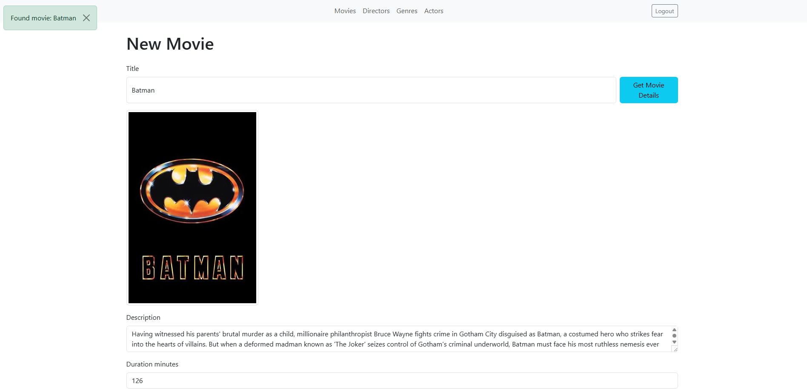

# Movies Base

A full-featured movie library application built with Ruby on Rails 8. This is my personal project, developed following Ruby on Rails documentation and best practices.

## Screenshots

### Dashboard


### Actors


### API - Movie Details


## Features

### Movie Management
- **CRUD operations** for movies, actors, directors, and genres
- **TMDB Integration** - Automatically fetch movie details (title, description, duration, country, poster) from The Movie Database API by simply entering a movie title
- **Cover images** - Upload custom covers or automatically download posters from TMDB
- **Advanced filtering & search** - Filter movies by title, director, genre, duration, and country using Ransack

### User System
- **Authentication** - User registration and login powered by Devise
- **Reviews & Ratings** - Logged-in users can rate movies (1-5 stars) and leave comments

### Data Relationships
- Movies belong to a director and genre
- Actors can be assigned to movies through roles
- Full many-to-many relationship between movies and actors

### API
- RESTful JSON API with sorting and filtering capabilities
- Serialized responses using Active Model Serializers

## Tech Stack

- **Framework:** Ruby on Rails 8.0
- **Database:** PostgreSQL (Neon serverless)
- **Authentication:** Devise
- **Search/Filtering:** Ransack
- **Styling:** Bootstrap 5
- **File Storage:** Active Storage (AWS S3 ready)
- **Background Jobs:** Sidekiq + Solid Queue
- **External API:** TMDB (The Movie Database)
- **Testing:** RSpec, Factory Bot, Faker

## Installation

### Prerequisites
- Ruby 3.4.1
- PostgreSQL (or Neon account)
- Bundler

### Setup

1. Clone the repository:
```bash
git clone https://github.com/jczuba01/movies-base.git
cd movies-base
```

2. Install dependencies:
```bash
bundle install
```

3. Configure environment variables:
```bash
cp .env.example .env
# Edit .env with your database credentials
```

4. Setup database:
```bash
rails db:create
rails db:migrate
rails db:seed  # Optional: load sample data
```

5. Configure TMDB API (for movie auto-fill feature):
```bash
rails credentials:edit
# Add your TMDB API key:
# tmdb:
#   api_key: your_tmdb_api_key_here
```

6. Start the server:
```bash
rails server
```

Visit `http://localhost:3000`

## Environment Variables

| Variable | Description |
|----------|-------------|
| `DATABASE_URL` | PostgreSQL connection string |

## Usage

1. **Register an account** to access the application
2. **Add movies** manually or use "Fetch from TMDB" to auto-fill movie details
3. **Create directors, actors, and genres** to categorize your movies
4. **Assign actors** to movies with their roles
5. **Rate and review** movies in your collection

## Testing

```bash
bundle exec rspec
```

## License

This project is open source and available under the [MIT License](LICENSE).

## Author

Jakub Czuba
